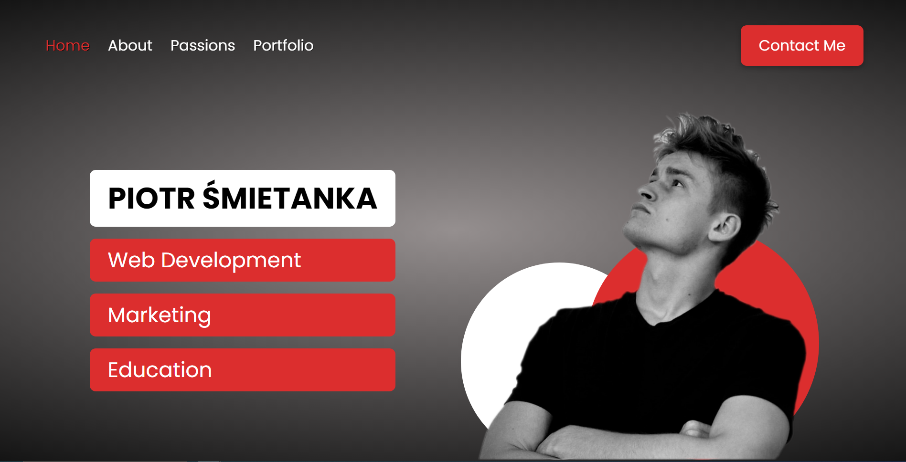
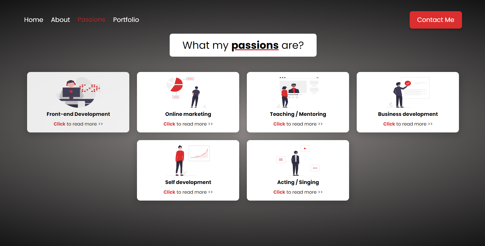
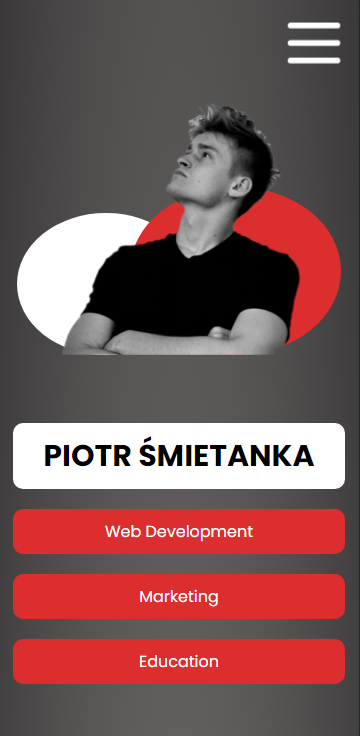
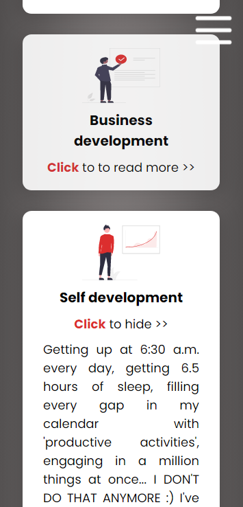
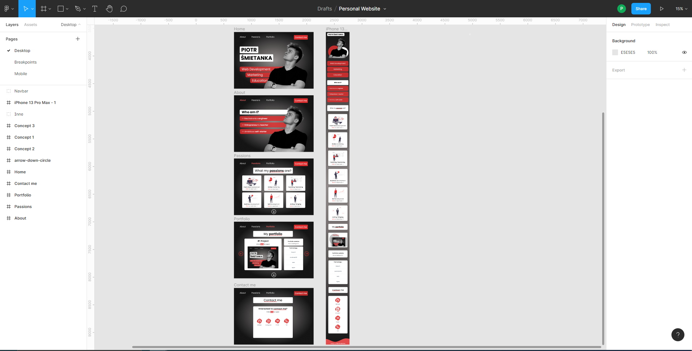

# Personal Landing Page

This project is a personal landing page about me and my projects.


## Table of Contents
* [General info](#general-info)
* [Technologies](#technologies)
* [Figma Project](#figma-project)
* [Launch](#launch)

## General Info

**The entire project was designed by me with Figma (Mobile & Desktop Viewport).**

### Destkop Viewport 1



### Destkop Viewport 2



### Mobile Viewport 1



### Mobile Viewport 2



## Figma Project



## Technologies
* React.js
* SASS

## Launch
To run this project, just open it in the browser:
```
https://petercreams.github.io/personal-landing-page/
```
